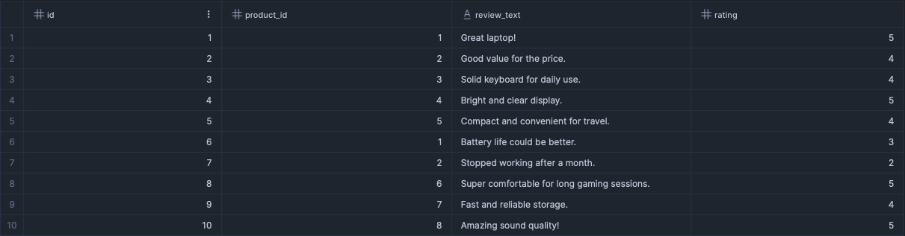
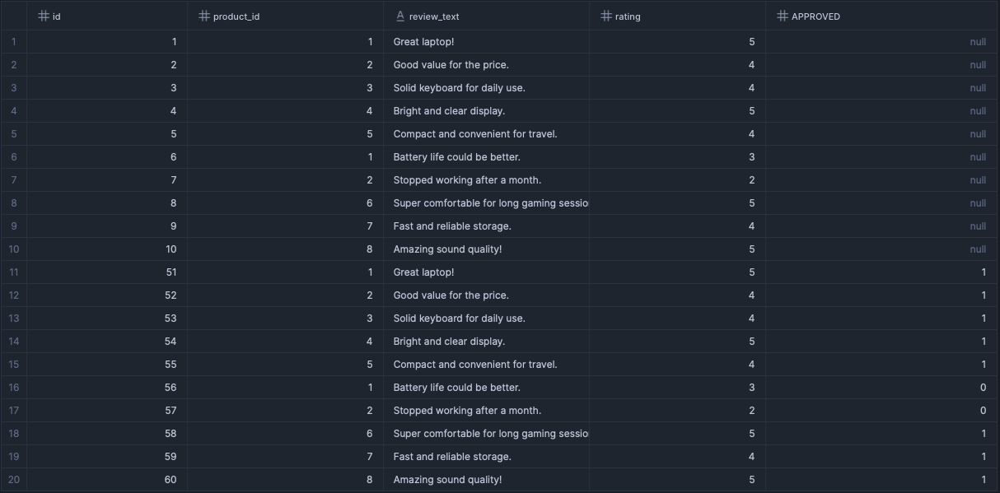
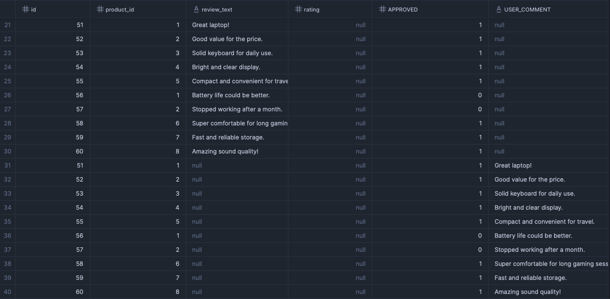

<h1>Database/Snowflake Replication</h1>

<p>
    Project to replicate On-Prem Databases into Snowflake cloud storage
</p>

<h2>Requisites</h2>

Mandatory Environment Variables defined in .env to execute replication:
```
aws_access_key_id = aws access key
aws_secret_access_key = aws secret access key
region = aws region
mysql_password = database passoword to access mysql
postgres_password = database passoword to access postgres
sw_user = snowflake user
sw_role = snowflake role
sw_password = snowflakse user password
sw_account = snowflake account
```

<h2>Querying logs</h2>

This query will create a Snowflake's Temporary Stage that allows user analyze the logs stored in the cloud, 
helping the enginners to find failures root causes:
```sql
CREATE OR REPLACE TEMP STAGE logs
  STORAGE_INTEGRATION=<STORAGE_INTEGRATION>
  URL='s3://<bucket>>/logs/year=<year>/month=<month>/day=<day>/'
  FILE_FORMAT=(TYPE='CSV', FIELD_DELIMITER='|');
SELECT 
    logs.$1 asctime, 
    logs.$2 levelname, 
    logs.$3 message
FROM @logs logs
ORDER BY logs.$1
```

<h2>Schema evolution</h2>

This project has Schema Inference and Evolution implemented, ensuring a proper and automated replication of any schema adjustment applied on the source to Snowflake.

This section shows the results of Schema Evolution behavior after applying multiple and very common DDL operations such as adding, deleting and renaming columns, and any other relevant operation.

<h3>Table with no DDL changes</h3>

Consider this raw table as the main example, no DDL changes were applied to table so far. It has four columns: id integer, product_id integer, review_txt string and rating integer. Now, some DDL changes will be applied and the results will be documented in the next sub sections:



<h3>Adding a new column</h3>

A new column <i>approved</i> will be created on source database using the follow command:

```sql
ALTER TABLE reviews ADD COLUMN approved TINYINT DEFAULT 0;
UPDATE reviews SET approved = 1 WHERE rating > 3;
```

The new column <i>approved</i> appeared in uppercase (<i>APPROVED</i>) with new values coming from the source, setting the default <i>null</i> as default value for the column. That schema evolution was fully managed by Snowflake after running replication, no DDL statements on Snowflake was executed:



<h3>Deleting a column</h3>

To perform this test, the column <i>rating</i> will be dropped on the source database, and the replication will be executed again:

```sql
ALTER TABLE reviews DROP COLUMN rating;
```

The column <i>rating</i> are still present in Snowflake, but the new values coming from the replication script are now set as <i>null</i> values:


<h3>Renaming a column</h3>

For testing, the column <i>review_text</i> will be renamed to <i>user_comment</i> in order to check the schema impact in the Snowflake. Follow command was executed:

```sql
ALTER TABLE reviews RENAME COLUMN review_text TO user_comment;
```

As results, the previous column <i>review_text</i> still remains in the Snowflake table, but the rename operation reflected this change by creating a new column <i>user_comment</i>, and setting <i>null</i> values to the older column:


