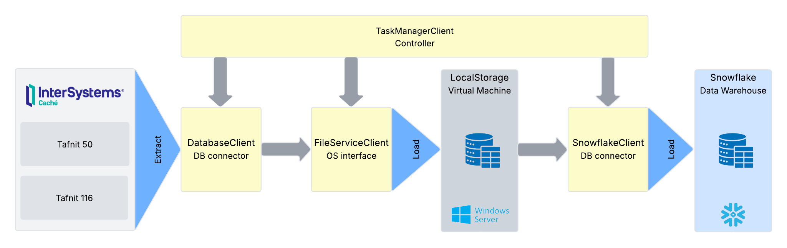
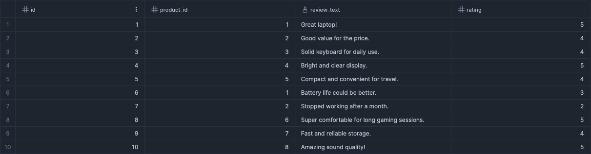
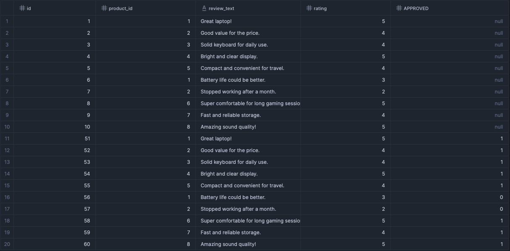
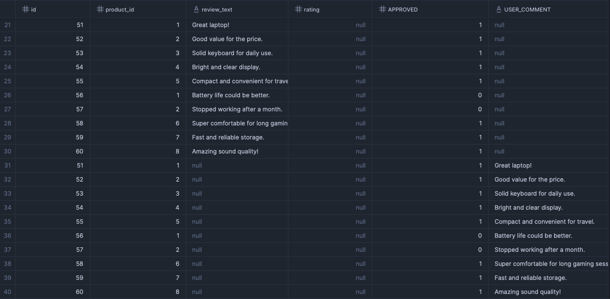

<h1>Database/Snowflake Replication</h1>

<p>
    Project to replicate data from on-prem databases into Snowflake cloud storage or any Cloud Storage such as S3
</p>

<h2>ELT Configuration</h2>

This section lists all possibles (mandatory or optional) parameters, descriptions and the file's structure. This config files specifies the credentials for Database, Snowflake and Public Cloud connection, as well as operational parameters to ensure good funcionality and optimized execution. The ```config.json``` file stores global configurations.

To add a new ELT replication, just create a new configuration YAML file in <i>configs</i> folder, following the pattern: <i><b><file_number></b>-config-<b><replication_name></b>.yaml</i>. Where file number identifies the file id and replication name a human-friendly name.

> **⚠️ <span style="color:red">Warning</span>:** Make sure the <i>username</i> defined in <i>database_connection</i> has only SELECT privilege. It's very important to prevent any SQL injection attack.

Below is the config template and the explanation of each parameter. Commented parameters are optional:

```yaml
config_enabled: (bool) Enables or disables the ELT configuration. Set to true to activate the pipeline
description: (str) A brief summary of the ELT process or pipeline purpose
cloud:
  provider: (str) The cloud service provider ('aws', 'gcp' or ...)
  bucket: (str) The name of the cloud storage bucket used for staging or storing files
  # partitionate_data: (bool) (optional) Indicates whether to partition data in the cloud storage, default value is False
  # aws_access_key_id: (str) (optional) Environment variable name with AWS Access Key ID to connect to AWS cloud platform, default value takes aws_access_key_id from .aws/credentials
  # aws_secret_access_key: (str) (optional) Environment variable name with AWS Secret Access Key to connect to AWS cloud platform, default value takes aws_secret_access_key from .aws/credentials
  # region: (str) (optional) Environment variable name with AWS Region, default value takes region from .aws/credentials
snowflake_connection:
  authenticator: (str) Type of authenticator to be used to connect to Snowflake (it impacts the parameters passed)
  account: (str) Environment variable name with Snowflake account identifier value
  user: (str) Environment variable name with username value for Snowflake authentication
  private_key_file: (str) Environment variable name with the private key path, used in case of authenticator SNOWFLAKE_JWT
  private_key_file_pwd: (str) Environment variable name with the private key password, used in case of authenticator SNOWFLAKE_JWT
  password: (str) Environment variable name with password value for Snowflake authentication, used in case of authenticator SNOWFLAKE
  raw_database: (str) Raw target Snowflake database
  dwh_database: (str) Processed target Snowflake database
  schema: (str) Target schema in the raw database
  # role: (str) (optional) Environment variable name with Snowflake user role value for session, default is None
  # warehouse: (str) (optional) Snowflake virtual warehouse for compute resources, default values is 'INGESTION_WH'
  # stages_type: (str) (optional) Type of Snowflake stage in lowercase ('external' or 'internal'), default value is 'internal'
  # storage_integration: (str) (optional) Name of the Snowflake storage integration, mandatory in case of snowflake_connection.stages_type defined as 'external', default None
  # tables_prefix: (str) The prefix to be added to all tables (e.g, database.schema.<tables_prefix>_<table_name>)
database_connection:
  engine: (str) SQLAlchemy engine string for the database type and driver
  host: (str) Environment variable name with hostname or IP address value of the source database
  port: (int) Port number for the database connection
  username: (str) Environment variable name with username value for database authentication
  password: (str) Environment variable name with password value for database authentication
  database: (str) Name of the source database
  # schema: (str) (optional) Schema within the source database, default value assumes database name
  # jar_file_path: (str) (optional) Path to the JDBC driver jar file (applicable only in case of engine 'com.intersys.jdbc.CacheDriver'
extraction_file: 
  # file_format: (str) (optional) Format of the extracted files in lowercase ('csv' or 'parquet'), default is 'parquet'
  # local_storage_directory: (str) (optional) Local directory path for temporary file storage, default value is 'data/'
  # exclude_file_after_uploading: (bool) (optional) Whether to delete local files after uploading to public cloud storage or Snowflake stage, default value is True
tables: 
  - table_name: (str) Table name on source database to be extracted
    # table_renamed: (str) New table name (rename)
    # size: (int) (optional) Number of records per batch to be ingested (e.g., table with 1050 records and size 100 will generate 10 files with 100 and one with 50)
    # fields: (list[str]) (optional) List of fields to be used in select query (select <fields> from table where <where>)
    # where: (str) (optional) SQL where statement to be applied to the query (select * from table where <where>)
  - ...
```

<b>Notes</b>:
- The <i>cloud</i> parameter is an optional set of config, if not declared then the replication will assume no public cloud and not push files to any public cloud storage. If declared, files will be uploaded to the specified cloud storage bucket and then deleted in local storage if <i>extraction_file.exclude_file_after_uploading</i>=true. But, <i>cloud</i> is mandatory in case of (<i>snowflake_connection.stages_type</i>='external').
- The <i>snowflake_connection</i> parameter is an optional set of config, if not declared then the replication will assume no Snowflake account and not push files into Snowflake stages. If declared, files will be uploaded to the Snowflake stages (internal or external) and then deleted in local storage if <i>extraction_file.exclude_file_after_uploading</i>=true.
- In case of no <i>cloud</i> and <i>snowflake_connection</i> declared in ELT config files, data will extracted from source database and stored in the local storage (and won't be deleted) until either <i>cloud</i> or <i>snowflake_connection</i> was declared defined. After that, all historical data will be pushed as remaining file into the defined cloud tool.

<h2>Framework diagram</h2>

This section outlines the architecture and operational flow of the data ingestion framework. It describes how raw data from on-premise database is systematically extracted and loaded into Snowflake.

The framework is composed by five major client models: Task Manager Client, Database Client, Snowflake Client, File Service Client and Cloud Client.

Task Manager client is responsible for orchestrate all the other models, calling their methods and organizing the operational flow. The class Database client is a interface to connect to the source database (available databases are mysql, postgres and InterSystem Caché). File Service client model deal with the files managment and OS operations. Cloud client works as an interface with the cloud provider, pushing files to the cloud storage if necessary (only AWS was implemented so far).

To summarize, Database model extract the data from the source database and sends the data to the File Service client, which stores all files as parquet or csv in the intermediary local storage. After this first step, there are foud possible options: (1) the data is kept in the local storage (if no cloud or snowflake account were passed); (2) files are pushed to cloud provider storage only; (3) files are pushed to snowflake storage only; (4) files were pushed to both cloud storage and snowflake at same time. 



Important to mention that Snowflake client manages all the ingestion flow automatically, creating databases, schemas, file formats, stages, tables and views, also uploding files into stages and copying data from stages to the tables. Both schema inference and schema evolution were implemented, ensuring consistency and simplifying the ingestion.


<h2>Schema evolution</h2>

This project has Schema Inference and Evolution implemented, ensuring a proper and automated replication of any schema adjustment applied on the source to Snowflake.

This section shows the results of Schema Evolution behavior after applying multiple and very common DDL operations such as adding, deleting and renaming columns, and any other relevant operation.

<h3>Table with no DDL changes</h3>

Consider this raw table as the main example, no DDL changes were applied to table so far. It has four columns: id integer, product_id integer, review_txt string and rating integer. Now, some DDL changes will be applied and the results will be documented in the next sub sections:



<h3>Adding a new column</h3>

A new column <i>approved</i> will be created on source database using the follow command:

```sql
ALTER TABLE reviews ADD COLUMN approved TINYINT DEFAULT 0;
UPDATE reviews SET approved = 1 WHERE rating > 3;
```

The new column <i>approved</i> appeared in uppercase (<i>APPROVED</i>) with new values coming from the source, setting the default <i>null</i> as default value for the column. That schema evolution was fully managed by Snowflake after running replication, no DDL statements on Snowflake was executed:



<h3>Deleting a column</h3>

To perform this test, the column <i>rating</i> will be dropped on the source database, and the replication will be executed again:

```sql
ALTER TABLE reviews DROP COLUMN rating;
```

The column <i>rating</i> are still present in Snowflake, but the new values coming from the replication script are now set as <i>null</i> values:


<h3>Renaming a column</h3>

For testing, the column <i>review_text</i> will be renamed to <i>user_comment</i> in order to check the schema impact in the Snowflake. Follow command was executed:

```sql
ALTER TABLE reviews RENAME COLUMN review_text TO user_comment;
```

As results, the previous column <i>review_text</i> still remains in the Snowflake table, but the rename operation reflected this change by creating a new column <i>user_comment</i>, and setting <i>null</i> values to the older column:



<h2>Troubleshooting</h2>

<h3>Casting error during COPY</h3>
This error occurs when the table schema was wrongly inferred based on older stages. In other words, trying to convert a not compatible value to a specific data type. See a real example below:

```log
Failed to cast variant value "רכב עובד חברה אדי" to NUMBER
```

<b>Solution</b>: execute (with OR REPLACE statement) the query to recreate the table based on the current stage. 
